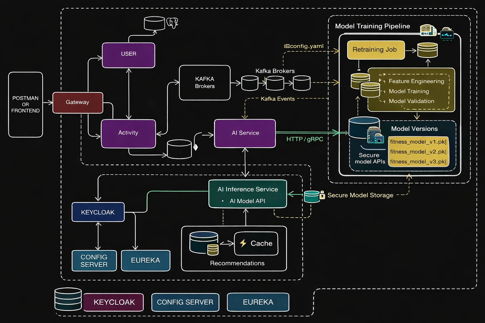

# AI-Powered Fitness Microservices Platform

A **cloud-native, event-driven fitness application** built using **Spring Boot microservices, Apache Kafka, AI/ML, FastAPI, Docker**, and modern web & mobile clients (**React.js & Flutter**).

This platform captures user fitness activities, processes them asynchronously, and generates **AI-driven personalized recommendations** in real time.

---

## 📌 Architecture Overview




---

## Key Features

- Microservices architecture with **Spring Boot**
- **API Gateway** as a single entry point
- **Service Discovery** using Eureka
- **Centralized Configuration** with Spring Cloud Config
- **Event-driven communication** using Apache Kafka
- **AI Recommendation Engine** (FastAPI + ML)
- **Docker-first local development**
- **React.js Web App** & **Flutter Mobile App**
- Scalable and cloud-ready (AWS / Kubernetes)

---

## 🧱 Technology Stack

### Backend
- Java 17
- Spring Boot
- Spring Cloud (Eureka, Config Server, Gateway)
- Spring Data JPA (PostgreSQL)
- Spring Data MongoDB
- Apache Kafka
- WebClient
- FastAPI (AI Service)
- Python (Machine Learning)

### Databases
- PostgreSQL (User data)
- MongoDB (Activity & events)

### Infrastructure
- Docker & Docker Compose
- Git-based Config Repository
- Kafka

### Frontend / Mobile
- React.js (Web)
- Flutter (Mobile)

---

## 🗂️ Project Structure

```
fitness-microservices-platform/
├── eureka-service/                  # Service Discovery
│   ├── src/main/java/com/fitness/eureka/
│   ├── pom.xml
│   └── Dockerfile
│
├── user-service/                    # User Service
│   ├── src/main/java/com/fitness/userservice/
│   ├── pom.xml
│   └── Dockerfile
│
├── activity-service/                # Activity Service
│   ├── src/main/java/com/fitness/activityservice/
│   ├── pom.xml
│   └── Dockerfile
│
├── ai-service/                      # Spring Boot AI Service
│   ├── src/main/java/com/fitness/aiservice/
│   ├── pom.xml
│   └── Dockerfile
│
├── python-ai-model/                 # Python AI Model Service
│   ├── model/
│   │   ├── __init__.py
│   │   ├── train_model.py
│   │   ├── predict.py
│   │   └── fitness_model.joblib
│   ├── api/
│   │   ├── __init__.py
│   │   ├── main.py                  # FastAPI application
│   │   └── kafka_consumer.py
│   ├── requirements.txt
│   ├── Dockerfile
│   └── .env
│
├── docker-compose.yml               # Docker composition for all services
└── README.md
└── docs/
    └── Architecture.png
```
